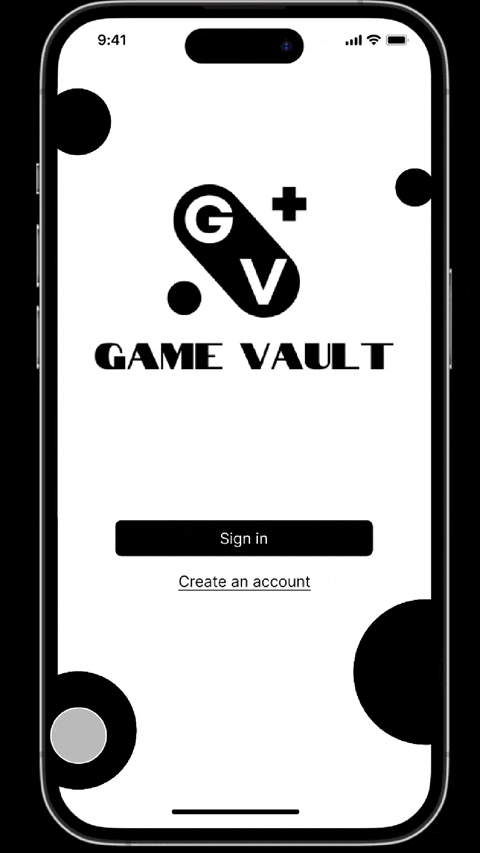

Original App Design Project - README
===

# Game Vault

## Table of Contents

1. [Overview](#Overview)
2. [Product Spec](#Product-Spec)
3. [Wireframes](#Wireframes)
4. [Schema](#Schema)

## Overview

### Description

*Game Vault* is a mobile app designed for gamers on all platforms, helping them find their next gaming obsession. With robust filters for genres, platforms, game types, and more, users can locate and discover video games that are specific to their interests. Regardless of your preference for fantasy RPGs, relaxing simulations, or action-packed survival games, *Game Vault* streamlines the search process and introduces you to games you’ll love.

### App Evaluation

- **Category:** Entertainment
- **Mobile:** Yes
- **Story:**  "Discover Your Next Favorite Game"
- **Market:** Gamers of all ages who enjoy findings new games, exploring different filters, and expanding their library
- **Habit:** Occasional use
- **Scope:** Slightly narrow

## Product Spec

### 1. User Stories (Required and Optional)

**Required Must-have Stories**

- [X] User can filter games by platform, genre, and other attributes
- [X] User can view a list of games based on their selected filters
- [X] User can see detailed information about a selected game
- [X] User can "favorite" a game for easy access later
- [ ] User can search for games by title

**Optional Nice-to-have Stories**

- [X]  User can see recommendations based on previous filters and/or searches
- [X]  User can see trending games
- [X]  User can visit website for selected game
- [X]  User can share game details with others via a share button
- [ ]  User can view and select their recent searches on the search screen

### 2. Screen Archetypes

- Launch Screen
    - User can select to login or register
- Login Screen
    - User can login
- Registration Screen
    - User can register
- Home Screen
    - User can view a carousel of trending games
    - User can view a carousel of recommended games
- Search Screen
    - User can search for a game with its title via the search bar
    - User can view and select their recent searches
- Filter Screen
    - User can select platforms, genres, and other filters to refine their game search
    - User can select "Show Results" to show results of filter
- Favorites Screen
    - User can view their "favorite" games
- Settings Screen
    - User can view app settings
- About - Settings Screen
    - User can view the "About" settings
- Profile - Settings Screen
    - User can view email and username
- Results Screen
    - User can view a list of games that match their selected filters or title search
- Game Detail View Screen
    - User can view title, platform, developer, description, release date, and trailer of the selected game

### 3. Navigation

**Tab Navigation** (Tab to Screen)

- [Home Symbol] - Home Screen
- [Magnifying Glass Symbol] - Search Screen
- [Filter Symbol] - Filter Screen
- [Bookmark Symbol] - Favorites Screen
- [Cog Symbol] - Settings Screen

**Flow Navigation** (Screen to Screen)

- Launch Screen
  => Login Screen
  => Registration Screen
- Login Screen
  => Home Screen
  => Registration Screen
- Registration Screen
  => Home Screen
  => Login Screen
- Home Screen
  => Game Detail View Screen
- Search Screen
  => Results Screen
- Filter Screen
  => Results Screen
- Favorites Screen
  => None
- Settings Screen
  => About - Settings Screen
  => Profile - Settings Screen
- About - Settings Screen
  => Settings Screen (using back button)
- Profile - Settings
  => Settings Screen (using back button)
- Results Screen
  => Game Detail View Screen
  => Search Screen (using back button)
  => Filter Screen (using back button)
- Game Detail View Screen
  => Home Screen (using back button)
  => Results Screen (using back button)

## Wireframes

### Digital Wireframes & Mockups

### Interactive Prototype

## Build Progress

Build Sprint 1:

Build Sprint 2:

## Schema 

### Models

[Model Name, e.g., User]
| Property | Type   | Description                                  |
|----------|--------|----------------------------------------------|
| username | String | unique id for the user post (default field)   |
| password | String | user's password for login authentication      |
| ...      | ...    | ...                          

### Networking

- [List of network requests by screen]
- [Example: `[GET] /users` - to retrieve user data]
- ...
- [Add list of network requests by screen ]
- [Create basic snippets for each Parse network request]
- [OPTIONAL: List endpoints if using existing API such as Yelp]
